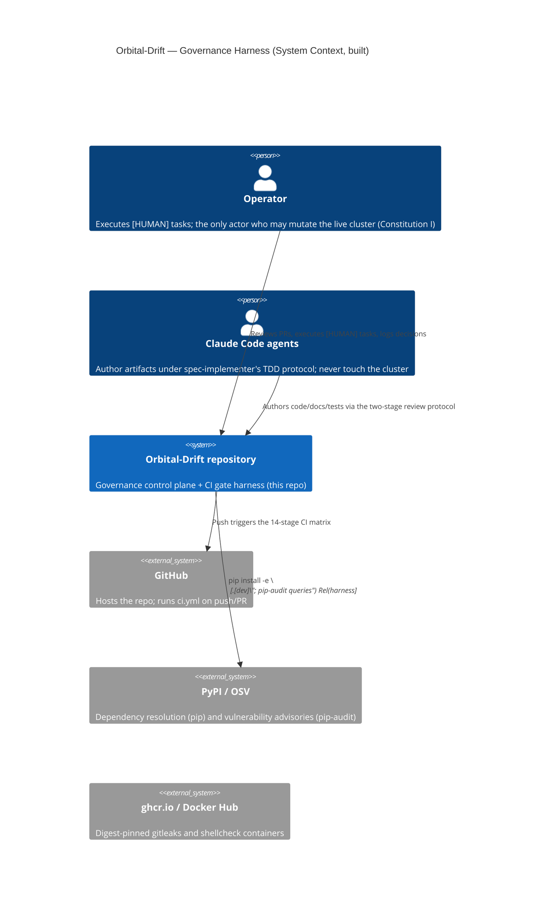

# Orbital-Drift Architecture (C4 Model)

**Audience:** operator + reviewing agents. **Status as measured at commit
`4ba5774` (2026-08-21):** Phase 0 of 6, task T002 of 52 complete (see
`specs/001-orbital-drift-ct/tasks.md` for the authoritative, live task state —
this document does not restate task-level detail, and where the two disagree
the tasks file wins).

Two diagrams: the **governance harness** (built today, enforced by CI) and the
**target MLOps platform** (planned; phases per `specs/001-orbital-drift-ct/
plan.md`, containers not yet deployed). Conflating "what runs" with "what is
designed" is exactly the failure mode `docs/decisions/000-phase0-technical-
decisions.md`'s AUTHORED-PROVISIONAL warnings exist to prevent, so the two are
kept in separate diagrams rather than one that would need a legend of dashed
boxes to stay honest.

## System Context — what exists today



## Container — the governance harness (built)

```mermaid
C4Container
    title Orbital-Drift — Governance Harness (Container, built)

    Person(operator, "Operator")
    Person(agent, "Claude Code agent")

    Container_Boundary(repo, "Orbital-Drift repository") {
        Container(constitution, ".specify/memory/constitution.md", "Markdown", "Supreme governing document; 7 principles")
        Container(charter, "charter/PROJECT-CHARTER.md", "Markdown", "Mechanized constraints C-1..C-6, subordinate to the constitution")
        Container(decisionlog, "docs/decision-log.md", "Markdown", "Mechanical gate ledger — DEC/RB/G ids; gates presence-check IDs here")
        Container(skill, ".claude/skills/*", "Markdown + frontmatter", "Gate table, run-the-gate, log-decision — staleness-checked against the decision log")
        Container(agents, ".claude/agents/*.md", "Markdown + frontmatter", "8 subagents: spec-implementer, spec-guardian, adversarial-reviewer, 5 domain agents")
        Container(checks, "ci/checks.sh", "POSIX sh", "Canonical runner for all 14 gate stages; sole source of gate logic")
        Container(guard, "src/orbital_drift/guard.py", "Python", "PreToolUse command analyzer (shlex-based); charter C-1/C-5")
        Container(prepush, "scripts/pre_push_scan.sh", "bash", "Authoritative C-5 destination gate, installed into .git/hooks/pre-push")
        Container(traceability, "src/orbital_drift/traceability.py", "Python", "Requirement-traceability matrix linter")
        Container(projections, "src/orbital_drift/projections.py", "Python", "Generates planning/roadmap.md + jira-import.csv from roadmap_data.py")
        Container(covcheck, "src/orbital_drift/covcheck.py", "Python", "Per-file coverage floor, run after the global floor")
        Container(tests, "tests/{unit,governance}/*", "pytest", "563 tests: harness behaviour, guard regression corpus, meta-tests")
    }

    System_Ext(ci, "GitHub Actions", "Thin caller: sh ci/checks.sh <stage> per matrix entry")
    System_Ext(claudesettings, ".claude/settings.json", "Deny-list (Principle I) + PreToolUse/SessionStart hooks")

    Rel(operator, decisionlog, "Logs DEC/RB/G entries")
    Rel(agent, agents, "Operates as one of the 8 roster agents")
    Rel(agents, checks, "make pre-pr / sh ci/checks.sh all before every PR")
    Rel(claudesettings, guard, "Invokes on every Bash tool call")
    Rel(guard, prepush, "First-pass filter; pre-push hook is authoritative")
    Rel(checks, tests, "unit/contract/smoke/cov/governance stages run pytest")
    Rel(checks, traceability, "traceability stage")
    Rel(checks, projections, "projections stage (byte-drift check)")
    Rel(checks, covcheck, "cov stage, after the global pytest-cov floor")
    Rel(ci, checks, "Every matrix entry")
    Rel(skill, decisionlog, "Freshness-checked against")
```



## Container — target MLOps platform (planned, not yet deployed)

Every container below is **planned**, gated behind the phase named on it. None
exists on any cluster today — Phase 0's own gate (`nvidia-smi` in a pod,
hello-world DAG, hello-world Argo GPU job) has not yet been demonstrated
(T012, `[HUMAN]`, blocked on T003/T005). This diagram exists so a reader can
see the target shape without mistaking it for current state; the phase gates
in `specs/001-orbital-drift-ct/plan.md` are the executable definition of
"planned" vs "real" as the project proceeds.

```mermaid
C4Container
    title Orbital-Drift — Target CT Platform (Container, PLANNED)

    Person(operator, "Operator", "Executes all cluster-mutating steps (Constitution I)")

    System_Ext(stac, "Earth Search STAC API", "Sentinel-2 L2A scene catalog")

    Container_Boundary(k3s, "k3s cluster (node A, RTX 5060 Ti host — Phase 0)") {
        Container(airflow, "Airflow", "KubernetesExecutor", "Ingest DAG (Phase 1), drift/retrain DAGs (Phase 3)")
        Container(argo, "Argo Workflows", "Workflow engine", "Training (Phase 2), shadow-eval (Phase 3)")
        Container(lakefs, "lakeFS", "Data versioning", "Branch-per-experiment; commit-addressable scenes (Phase 1)")
        Container(seaweedfs, "SeaweedFS", "S3-compatible store", "Backs lakeFS + MLflow artifacts (D-000/D-05)")
        Container(mlflow, "MLflow", "Tracking + registry", "Stages None/Staging/Production/Archived (Phase 2)")
        Container(drift, "Drift service", "Python (PSI/KS, standard libs only — Constitution II)", "Reference stats + trigger emitter with hysteresis (Phase 3)")
        Container(serving, "FastAPI serving", "Python", "Stage-loader, canary split, per-version metrics (Phase 4)")
        Container(prom, "kube-prometheus-stack", "Prometheus + Grafana", "Three alert classes: DAG failure, drift trigger, canary regression (Phase 5)")
    }

    Rel(operator, k3s, "terraform apply / helm install — human-executed only")
    Rel(airflow, stac, "STAC query + band fetch (Phase 1)")
    Rel(airflow, lakefs, "Commit-per-ingest")
    Rel(argo, lakefs, "Pinned snapshot read")
    Rel(argo, mlflow, "Logs {lakeFS commit, git SHA, config hash} — Constitution IV")
    Rel(drift, mlflow, "Reference stats from training snapshot")
    Rel(airflow, drift, "Post-ingest sensor")
    Rel(drift, argo, "Trigger → retrain workflow (Phase 3)")
    Rel(serving, mlflow, "Loads by registry stage")
    Rel(prom, k3s, "Scrapes DAG/Argo/GPU/drift/serving metrics")
```

## Notes on this document's own governance

- This file is descriptive, not authoritative: `specs/001-orbital-drift-ct/
  plan.md` (phases/gates), `docs/decisions/versions.md` (chart/image pins),
  and `traceability/REQUIREMENT-TRACEABILITY.md` (requirement→module mapping)
  are the sources of truth it summarizes. Update this file in the same PR that
  changes the shape of either diagram; a stale architecture diagram is worse
  than none (skill definition-of-done item 6).
- No component here is a hardcoded value in the Constitution-III sense — it
  is documentation of a design, not a runtime configuration. The runtime
  values (AOI, thresholds, image tags) live in Helm values / `config.py`
  (T015) per that principle.
