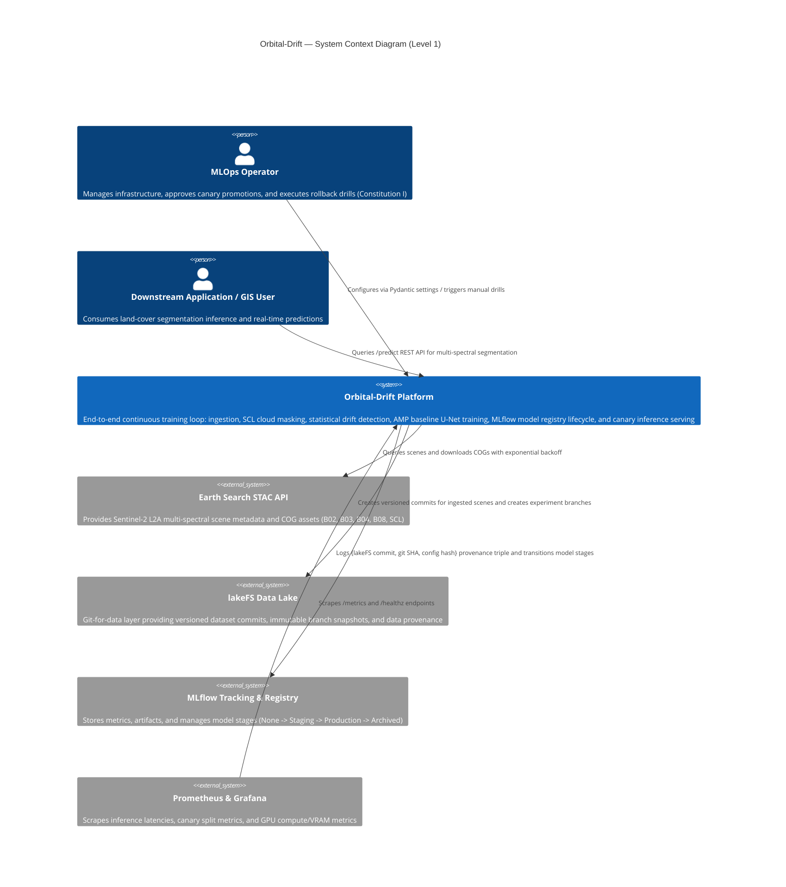
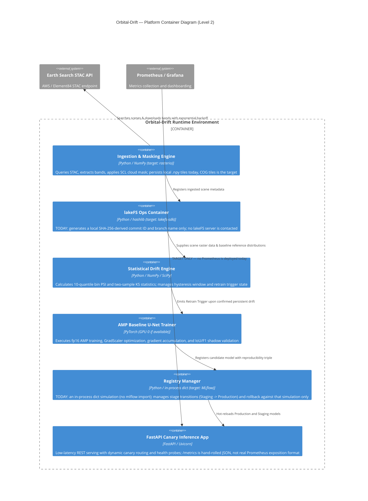

# Orbital-Drift Architecture (C4 Model)

**Audience:** Operator, architects, and reviewing agents.
**Status:** Application-layer Python code exists for ingest/drift/train/registry/serve
(Phase 1–4 code authored across PR#16/#17, not yet gate-reviewed) with simulated
lakeFS/MLflow backends; a hexagonal domain/ports/eval/observability/quality layer was
added but is largely disconnected from those modules; there is NO orchestration layer,
NO observability stack, and NO deployed cluster. See "0. Reality Check" below and
RB-010 (`docs/decision-log.md`).

This document outlines the architectural blueprint of **Orbital-Drift** using the C4 model (Context, Container, Component, Deployment). **The diagrams below describe the target architecture** — read section 0 first for what is actually true today.

---

## 0. Reality Check — Code vs. Deployed System (RB-010, 2026-09-01)

The C4 diagrams that follow describe the platform's **target** architecture. Per the
RB-010 governance reconciliation (`docs/decision-log.md`) and this session's six-lens
audit, here is what is actually true today:

- **What exists as code.** Application-layer Python modules exist for ingest
  (`ingest/stac_client.py`, `ingest/tile_store.py`, `ingest/cloud.py`), drift
  (`drift/metrics.py`, `drift/trigger.py`), train (`train/baseline.py`), registry
  (`registry/ops.py`), and serve (`serve/app.py`) — see
  `specs/001-orbital-drift-ct/tasks.md`'s per-task status annotations (T013–T045) for
  exactly what each does and does not cover; most are PARTIAL against their original
  task scope.
- **Simulated, not real, backends.** `data/lakefs_ops.py` fabricates commit IDs via
  `hashlib.sha256` — no `lakefs`/`lakefs-sdk` import or dependency exists anywhere in
  the repo (confirmed by search). `registry/ops.py` is a pure in-process dict
  simulation (`self._mock_registry`) — no `mlflow` import or dependency exists anywhere
  in the repo (confirmed by search). The diagrams below label these containers/
  components "lakefs-sdk" and "MLflow" as their **target** technology, annotated
  inline as not-yet-real.
- **The hexagonal layer is disconnected.** `domain/`, `ports/`, `eval/`,
  `observability/`, and `quality/` (added by PR#17, "Phase 0-R") exist, but of the five
  `ports/*.py` Protocols (`catalog`, `compute`, `dataversion`, `registry`, `tiles`),
  **0 of 5 have a real adapter**: each port's only concrete implementation is its own
  in-memory stdlib fake (`InMemorySceneCatalog`, `InMemoryCompute`,
  `InMemoryDataVersion`, `InMemoryModelRegistry`, `InMemoryTileStore`), and no module
  under `ingest/`, `data/`, `train/`, `registry/`, or `serve/` imports anything from
  `orbital_drift.ports` (confirmed by search — only `ports/__init__.py` itself
  references them). The Component diagram's "Implements protocols" relationship
  (section 3) is therefore aspirational, not built.
- **No orchestration layer.** `dags/` and `workflows/` each contain only `.gitkeep` —
  no Airflow DAG and no Argo Workflow exists anywhere in the repo.
- **No observability stack.** No Prometheus or Grafana is deployed anywhere; `serve/
  app.py`'s `/metrics` endpoint returns hand-rolled JSON (a `dict[str, Any]`), not real
  Prometheus exposition format, and zero `prometheus_client` usage exists anywhere in
  `src/` (confirmed by search).
- **No deployed cluster.** T003/T005/T012 (`specs/001-orbital-drift-ct/tasks.md`) —
  host prep, k3s install, and platform `terraform apply` — are `[HUMAN]`-gated and
  unexecuted. Nothing described below has ever run against a live k3s cluster; the
  Deployment diagram (section 4) is a target hardware topology, not a running system.

### Known follow-ups (not fixed by RB-010)

RB-010's 14-part remediation program does not resolve every open architectural
question. Two are named here so they are not lost:

- **Two disconnected registry implementations.** `registry/ops.py`'s
  `ModelRegistryOps` and `ports/registry.py`'s `InMemoryModelRegistry` each
  independently claim to be "the registry," with no shared implementation and no
  adapter connecting either to a real MLflow instance. Convergence onto one adapter is
  tracked as the forward-roadmap's Track A (adapter convergence) decision — not yet
  logged as a `docs/decision-log.md` entry.
- **AR-3, the OSCD-vs-DynamicEarthNet dataset decision, remains open** (RB-010,
  `docs/decision-log.md`, records that it "does not itself resolve AR-3 (dataset
  choice)"). The architecture as built is already DynamicEarthNet-shaped, not
  OSCD-shaped: `train/baseline.py`'s `SimpleUNet` and `data/dataset.py`'s
  `Sentinel2PatchDataset` both take a single multi-band image and emit a single
  multi-class segmentation map (`num_classes=10`) — there is no bi-temporal pairing
  (two dates in, one change mask out) anywhere in the training or dataset code, which
  is the OSCD shape.

---

## 1. System Context Diagram (Level 1)

The system context diagram illustrates how human operators, external data providers, and downstream consumers interact with the Orbital-Drift Continuous Training platform.



> **Target-state diagram (see section 0).** `stac_api` is real (Earth Search is a
> public HTTP API). `lakefs` and `mlflow` are NOT integrated — `data/lakefs_ops.py`
> and `registry/ops.py` are local simulations with no `lakefs-sdk`/`mlflow` import or
> dependency anywhere in the repo. `monitoring` (Prometheus/Grafana) is not deployed at
> all, and `orbital_drift`'s `/metrics` returns hand-rolled JSON, not real Prometheus
> exposition format.

---

## 2. Container Diagram (Level 2)

The container diagram shows the high-level software containers and services comprising the Orbital-Drift system.



> **Target-state diagram (see section 0).** Labels above mark what each container
> actually does today versus its target technology; none of `ingest_svc`,
> `lakefs_client`, `registry_ops`, or `serving_app` talks to a real external system —
> `stac` (Earth Search) is the only real external dependency currently exercised, and
> only when a caller supplies network access (no scheduler calls it today; `dags/` is
> empty).

---

## 3. Component Diagram (Level 3: Hexagonal Ports & Adapters Architecture)

The component diagram details the internal structural design of the Python package `orbital_drift`, adhering to a strict **Hexagonal (Ports & Adapters)** architecture and Constitution II/III/VII constraints.

```mermaid
C4Component
    title Orbital-Drift — Component Diagram (Level 3: Hexagonal Architecture)

    Container_Boundary(core_domain, "Domain Layer (Pure Primitives — Zero 3rd Party Deps)") {
        Component(geometry, "domain/geometry.py", "BoundingBox, Point", "Timezone-independent spatial extent validation")
        Component(temporal, "domain/temporal.py", "TemporalRange", "Timezone-aware ISO-8601 interval arithmetic")
        Component(scene_dom, "domain/scene.py", "SceneMetadata", "Normalized multi-spectral scene representations")
        Component(lineage, "domain/lineage.py", "CanonicalLineageHash", "Order-invariant JSON canonical SHA-256 provenance triples")
        Component(errors, "domain/errors.py", "DomainError hierarchy", "Exact exception hierarchy for domain invariant violations")
    }

    Container_Boundary(ports_layer, "Ports Layer (Abstract Protocols & Deterministic Fakes)") {
        Component(catalog_port, "ports/catalog.py", "CatalogPort Protocol", "STAC query interface abstractions")
        Component(compute_port, "ports/compute.py", "ComputePort Protocol", "GPU batch job execution abstractions")
        Component(dataversion_port, "ports/dataversion.py", "DataVersionPort, InMemoryDataVersion", "Dataset branching and commit protocols with in-memory fakes")
        Component(registry_port, "ports/registry.py", "ModelRegistryPort Protocol", "Stage transition and rollback protocols")
        Component(tiles_port, "ports/tiles.py", "TileStorePort Protocol", "Multi-spectral raster I/O protocols")
    }

    Container_Boundary(eval_layer, "Evaluation Layer (Statistical Promotion & Calibration Gates)") {
        Component(bootstrap, "eval/bootstrap.py", "SpatialBlockBootstrap", "Moving-block spatial bootstrap for dependent spatial metrics")
        Component(calibration, "eval/calibration.py", "ExpectedCalibrationError", "Quantile and uniform reliability curve calibration estimators")
        Component(ranking, "eval/ranking.py", "AveragePrecisionScore", "Average precision ranking evaluation")
        Component(spatial, "eval/spatial.py", "MoransI", "Row-standardised spatial autocorrelation with thread-safe Lock")
        Component(superiority, "eval/superiority.py", "SuperiorityGate", "Paired spatial block-bootstrap promotion gate with positive effect guards")
    }

    Container_Boundary(observability_layer, "Observability & Governance Layer") {
        Component(logging_mod, "observability/logging.py", "Structured Logger", "JSON/Plain formatting with recursive credential redaction at all depths")
        Component(context_mod, "observability/context.py", "ExecutionContext", "Async context variables for correlation and request binding")
        Component(records_mod, "observability/records.py", "DecisionRecord, GateState", "Durable 4-state gate ledger with frozen metadata and ISO-8601 awareness")
        Component(hardcode, "quality/hardcode_scan.py", "AST Hardcode Scanner", "Constitution III compliance scanner prohibiting hardcoded values")
    }

    Container_Boundary(adapters_layer, "Adapters Layer (Framework & Infrastructure Integrations)") {
        Component(config, "config.py", "Pydantic Settings", "Validated environment settings and hyperparameter schemas")
        Component(cloud, "ingest/cloud.py", "NumPy", "SCL Cloud Mask evaluator and cloud cover threshold filters")
        Component(stac_client, "ingest/stac_client.py", "requests / STAC", "Earth Search client with exponential retry budget")
        Component(tile_store, "ingest/tile_store.py", "Pathlib / NumPy", "Multi-spectral raster tile storage with throughput profiling")
        Component(dataset, "data/dataset.py", "PyTorch Dataset", "Multi-spectral patch generator slicing cubes into normalized tensors")
        Component(lakefs_ops, "data/lakefs_ops.py", "hashlib only (no lakefs/lakefs-sdk import)", "TODAY: local SHA-256 commit-ID simulation; lakeFS branch mgmt/snapshot pinning is the target, not built")
        Component(baseline, "train/baseline.py", "PyTorch / AMP", "SimpleUNet segmentation architecture, fp16 autocast, GradScaler")
        Component(registry_ops, "registry/ops.py", "in-process dict (no mlflow import)", "TODAY: dict-simulated stage transitions (None -> Staging -> Production -> Archived); real MLflow Registry is the target, not built")
        Component(metrics, "drift/metrics.py", "NumPy / SciPy", "PSI 10-quantile bins and 2-sample Kolmogorov-Smirnov sensor")
        Component(trigger, "drift/trigger.py", "State Machine", "Hysteresis windowing, cooldown limiter, queue-depth-1 coalescing")
        Component(app, "serve/app.py", "FastAPI", "REST inference API (/predict), canary traffic splitter, /healthz, /metrics")
    }

    Rel(adapters_layer, ports_layer, "TARGET ONLY — 0 of 5 ports have a real adapter today (RB-010)")
    Rel(ports_layer, core_domain, "References domain entities")
    Rel(eval_layer, core_domain, "Consumes domain primitives")
    Rel(adapters_layer, observability_layer, "Mostly TARGET ONLY — only eval/ uses structured/redacted logging today; every other pipeline module (ingest/data/train/registry/drift/serve) uses unredacted stdlib logging")
```

> **Target-state diagram (see section 0).** The Adapters Layer and Ports Layer are NOT
> wired together: no module under `ingest/`, `data/`, `train/`, `registry/`, or
> `serve/` imports anything from `orbital_drift.ports` (confirmed by search). Each
> port's only concrete implementation is its own in-memory stdlib fake, defined and
> used only within `ports/` itself. The Domain, Ports, and Eval layers are
> internally coherent and tested; they are just not yet connected to the "real"
> modules pictured in the Adapters Layer above.

---

## 4. Deployment Diagram (Level 4: Dual-GPU Node Topology)

The deployment diagram illustrates the physical hardware allocation and device isolation across dual NVIDIA GPUs.

```mermaid
C4Deployment
    title Orbital-Drift — Dual-GPU Physical Deployment Diagram (Level 4)

    Deployment_Node(host, "Node A (Workstation / CI Node)", "Windows 11 / Linux (CUDA 13.2 / PyTorch 2.11+cu128)") {
        Deployment_Node(cpu_ram, "Host System", "Multi-Core CPU / 64GB System RAM") {
            Container(disk, "NVMe Tile Store", "Fast local storage for COG raster cache & metadata")
        }

        Deployment_Node(gpu0, "GPU 0: NVIDIA GeForce RTX 5060 Ti", "16GB VRAM (Dedicated Training Device)") {
            Container(train_proc, "PyTorch U-Net Training Process", "Runs with torch.amp.autocast('cuda') & GradScaler; grad_accum_steps=2; Peak VRAM ~3.2GB")
        }

        Deployment_Node(gpu1, "GPU 1: NVIDIA GeForce RTX 5060", "8GB VRAM (Dedicated Inference Device)") {
            Container(serve_proc, "FastAPI Serving Container", "Runs Uvicorn worker loading Production and Staging models; Canary routing; Memory cap 4GB")
        }
    }

    Rel(train_proc, disk, "Reads multi-spectral patches from NVMe")
    Rel(serve_proc, gpu1, "Executes low-latency forward pass on cuda:1")
```

> **Target-state diagram (see section 0).** This describes the intended dual-GPU
> hardware topology, not a running deployment: T003/T005/T012
> (`specs/001-orbital-drift-ct/tasks.md`) — host prep, k3s install, and platform
> `terraform apply` — are `[HUMAN]`-gated and unexecuted, so no k3s cluster exists yet
> and none of the processes pictured above have ever run against it.

---

## 5. Governance & Verification Harness

The governance harness enforces architectural integrity and reproducibility via automated gates:

- **Zero-Skip Policy**: Every test in the multi-tier suite must execute deterministically without unexcused skips.
- **Traceability Linter**: `src/orbital_drift/traceability.py` ensures requirement-to-test mapping in `REQUIREMENT-TRACEABILITY.md`.
- **Per-File & Global Coverage Floor**: `src/orbital_drift/covcheck.py` mandates strict coverage thresholds (measured $\ge 95\%$).
- **Secret Scanning**: `ci/gitleaks.toml` enforces pre-commit and CI secret scanning with zero global path exemptions.
