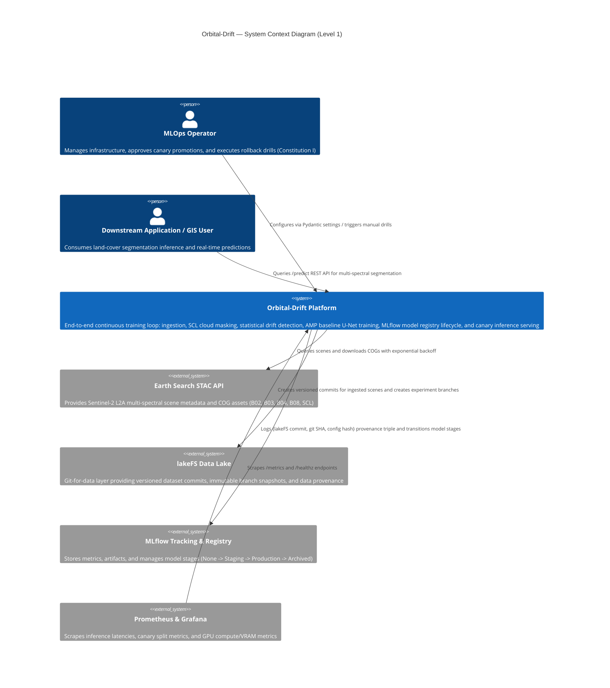
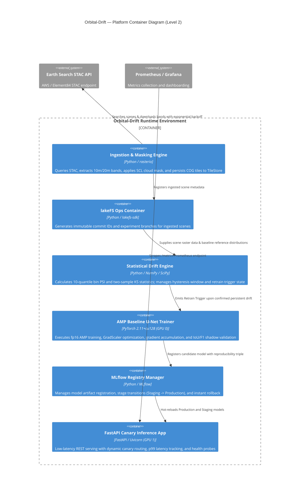

# Orbital-Drift Architecture (C4 Model)

**Audience:** Operator, architects, and reviewing agents.
**Status:** Multi-Spectral Continuous Training (CT) & Canary Deployment Pipeline (Phase 1–5 Core Realized).

This document outlines the architectural blueprint of **Orbital-Drift** using the C4 model (Context, Container, Component, Deployment).

---

## 1. System Context Diagram (Level 1)

The system context diagram illustrates how human operators, external data providers, and downstream consumers interact with the Orbital-Drift Continuous Training platform.



---

## 2. Container Diagram (Level 2)

The container diagram shows the high-level software containers and services comprising the Orbital-Drift system.



---

## 3. Component Diagram (Level 3: Hexagonal Ports & Adapters Architecture)

The component diagram details the internal structural design of the Python package `orbital_drift`, adhering to a strict **Hexagonal (Ports & Adapters)** architecture and Constitution II/III/VII constraints.

```mermaid
C4Component
    title Orbital-Drift — Component Diagram (Level 3: Hexagonal Architecture)

    Container_Boundary(core_domain, "Domain Layer (Pure Primitives — Zero 3rd Party Deps)") {
        Component(geometry, "domain/geometry.py", "BoundingBox, Tile", "Timezone-independent spatial extent validation")
        Component(temporal, "domain/temporal.py", "TemporalRange", "Timezone-aware ISO-8601 interval arithmetic")
        Component(scene_dom, "domain/scene.py", "SceneMetadata", "Normalized multi-spectral scene representations")
        Component(lineage, "domain/lineage.py", "CanonicalLineageHash", "Order-invariant JSON canonical SHA-256 provenance triples")
        Component(errors, "domain/errors.py", "DomainError hierarchy", "Exact exception hierarchy for domain invariant violations")
    }

    Container_Boundary(ports_layer, "Ports Layer (Abstract Protocols & Deterministic Fakes)") {
        Component(catalog_port, "ports/catalog.py", "CatalogPort Protocol", "STAC query interface abstractions")
        Component(compute_port, "ports/compute.py", "ComputePort Protocol", "GPU batch job execution abstractions")
        Component(dataversion_port, "ports/dataversion.py", "DataVersionPort, InMemoryDataVersion", "Dataset branching and commit protocols with in-memory fakes")
        Component(registry_port, "ports/registry.py", "ModelRegistryPort Protocol", "Stage transition and rollback protocols")
        Component(tiles_port, "ports/tiles.py", "TileStorePort Protocol", "Multi-spectral raster I/O protocols")
    }

    Container_Boundary(eval_layer, "Evaluation Layer (Statistical Promotion & Calibration Gates)") {
        Component(bootstrap, "eval/bootstrap.py", "SpatialBlockBootstrap", "Moving-block spatial bootstrap for dependent spatial metrics")
        Component(calibration, "eval/calibration.py", "ExpectedCalibrationError", "Quantile and uniform reliability curve calibration estimators")
        Component(ranking, "eval/ranking.py", "AveragePrecisionScore", "Average precision ranking evaluation")
        Component(spatial, "eval/spatial.py", "MoransI", "Row-standardised spatial autocorrelation with thread-safe Lock")
        Component(superiority, "eval/superiority.py", "SuperiorityGate", "Paired spatial block-bootstrap promotion gate with positive effect guards")
    }

    Container_Boundary(observability_layer, "Observability & Governance Layer") {
        Component(logging_mod, "observability/logging.py", "Structured Logger", "JSON/Plain formatting with recursive credential redaction at all depths")
        Component(context_mod, "observability/context.py", "ExecutionContext", "Async context variables for correlation and request binding")
        Component(records_mod, "observability/records.py", "DecisionRecord, GateState", "Durable 4-state gate ledger with frozen metadata and ISO-8601 awareness")
        Component(hardcode, "quality/hardcode_scan.py", "AST Hardcode Scanner", "Constitution III compliance scanner prohibiting hardcoded values")
    }

    Container_Boundary(adapters_layer, "Adapters Layer (Framework & Infrastructure Integrations)") {
        Component(config, "config.py", "Pydantic Settings", "Validated environment settings and hyperparameter schemas")
        Component(cloud, "ingest/cloud.py", "NumPy", "SCL Cloud Mask evaluator and cloud cover threshold filters")
        Component(stac_client, "ingest/stac_client.py", "requests / STAC", "Earth Search client with exponential retry budget")
        Component(tile_store, "ingest/tile_store.py", "Pathlib / NumPy", "Multi-spectral raster tile storage with throughput profiling")
        Component(dataset, "data/dataset.py", "PyTorch Dataset", "Multi-spectral patch generator slicing cubes into normalized tensors")
        Component(lakefs_ops, "data/lakefs_ops.py", "hashlib / lakefs", "lakeFS branch management and dataset snapshot pinning")
        Component(baseline, "train/baseline.py", "PyTorch / AMP", "SimpleUNet segmentation architecture, fp16 autocast, GradScaler")
        Component(registry_ops, "registry/ops.py", "MLflow Registry", "Model stage transitions (None -> Staging -> Production -> Archived)")
        Component(metrics, "drift/metrics.py", "NumPy / SciPy", "PSI 10-quantile bins and 2-sample Kolmogorov-Smirnov sensor")
        Component(trigger, "drift/trigger.py", "State Machine", "Hysteresis windowing, cooldown limiter, queue-depth-1 coalescing")
        Component(app, "serve/app.py", "FastAPI", "REST inference API (/predict), canary traffic splitter, /healthz, /metrics")
    }

    Rel(adapters_layer, ports_layer, "Implements protocols")
    Rel(ports_layer, core_domain, "References domain entities")
    Rel(eval_layer, core_domain, "Consumes domain primitives")
    Rel(adapters_layer, observability_layer, "Emits structured logs and decision records")
```

---

## 4. Deployment Diagram (Level 4: Dual-GPU Node Topology)

The deployment diagram illustrates the physical hardware allocation and device isolation across dual NVIDIA GPUs.

```mermaid
C4Deployment
    title Orbital-Drift — Dual-GPU Physical Deployment Diagram (Level 4)

    Deployment_Node(host, "Node A (Workstation / CI Node)", "Windows 11 / Linux (CUDA 13.2 / PyTorch 2.11+cu128)") {
        Deployment_Node(cpu_ram, "Host System", "Multi-Core CPU / 64GB System RAM") {
            Container(disk, "NVMe Tile Store", "Fast local storage for COG raster cache & metadata")
        }

        Deployment_Node(gpu0, "GPU 0: NVIDIA GeForce RTX 5060 Ti", "16GB VRAM (Dedicated Training Device)") {
            Container(train_proc, "PyTorch U-Net Training Process", "Runs with torch.amp.autocast('cuda') & GradScaler; grad_accum_steps=2; Peak VRAM ~3.2GB")
        }

        Deployment_Node(gpu1, "GPU 1: NVIDIA GeForce RTX 5060", "8GB VRAM (Dedicated Inference Device)") {
            Container(serve_proc, "FastAPI Serving Container", "Runs Uvicorn worker loading Production and Staging models; Canary routing; Memory cap 4GB")
        }
    }

    Rel(train_proc, disk, "Reads multi-spectral patches from NVMe")
    Rel(serve_proc, gpu1, "Executes low-latency forward pass on cuda:1")
```

---

## 5. Governance & Verification Harness

The governance harness enforces architectural integrity and reproducibility via automated gates:

- **Zero-Skip Policy**: Every test in the multi-tier suite must execute deterministically without unexcused skips.
- **Traceability Linter**: `src/orbital_drift/traceability.py` ensures requirement-to-test mapping in `REQUIREMENT-TRACEABILITY.md`.
- **Per-File & Global Coverage Floor**: `src/orbital_drift/covcheck.py` mandates strict coverage thresholds (measured $\ge 95\%$).
- **Secret Scanning**: `ci/gitleaks.toml` enforces pre-commit and CI secret scanning with zero global path exemptions.
