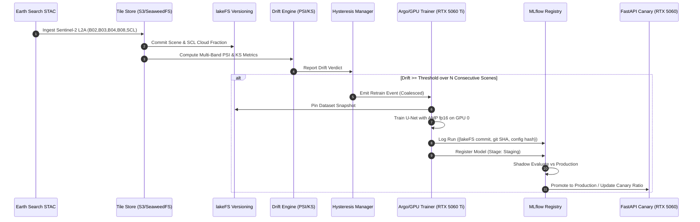

# Orbital-Drift: Development & Operational Reference Guide

**Audience:** a developer or operator working in this repository who needs the commands and
the hardware map in one place. Not a status document.

**Status:** corrected 2026-09-05 under RB-012 (`docs/decision-log.md`). The previous version
stated a coverage floor the repository does not use, documented a gate command that measures
less than the gate, and listed seven libraries as the as-built stack that are not
dependencies. Evidence: `docs/decisions/013-plan-artifact-reconciliation.md` D-013/03e.

**What this file is NOT.** It does not record what is built. `specs/001-orbital-drift-ct/tasks.md`
owns scope, `docs/decision-log.md` owns gates, and `docs/development/NEXT_STEPS.md` owns
sequencing. Where the diagram in §3 shows components that do not exist yet, §3 says so.

---

## 1. Quick Start Commands

### Environment Diagnostics & Setup

```bash
# Run the automated GPU & dependency diagnostic
python scripts/setup_gpu_env.py

# Inspect physical GPUs and VRAM allocations
nvidia-smi
```

### Running the gates

**`ci/checks.sh` is the canonical runner** (`README.md`, design D1). The `Makefile` is a thin
front-end (`make pre-pr` = `sh ci/checks.sh all`); on a box without GNU make, call the script
directly. The machine-specific invocation — interpreter pin, CA bundle, Docker preflight —
is encoded in the `run-the-gate` skill; read it before diagnosing a red stage.

```bash
sh ci/checks.sh all          # every stage
sh ci/checks.sh <stage>      # one stage; run with an unknown argument to list them
```

Four stages (`unit`, `gitleaks`, `hooks`, `coverage`) need a running Docker daemon. A stopped
daemon produces red positive-control failures in stages whose names suggest something else
entirely — check `docker info` first.

### Running suites directly (for a fast inner loop only)

These are *not* the gate and do not reproduce it. Use them while iterating; use `ci/checks.sh`
before opening a PR.

```bash
# Fast, hermetic tiers
pytest tests/unit -v
pytest tests/contract -v
pytest tests/governance -v

# Live GPU tiers (dual-GPU host only; these skip under the capability guard elsewhere)
pytest tests/sanity/test_gpu_sanity.py -v -s
pytest tests/integration/test_gpu_pipeline_live.py -v -s
pytest tests/e2e/test_user_journey_ct_loop.py -v -s
```

**Do not use a bare `pytest --cov` run to judge the coverage gate.** FR-011a defines the bar
as ONE combined statement-plus-branch rate, `(covered statements + covered arcs) / (statements
+ arcs)`, and the gate applies two floors, both pinned in `ci/versions.env`:
`COVERAGE_MIN_PERCENT` (global, ratified 85) and `COVERAGE_PER_FILE_MIN_PERCENT` (per-file,
90, applied by `orbital_drift.covcheck` after the global floor passes). A `--cov` run without
`--cov-branch` measures a strictly weaker quantity than the gate and applies neither floor —
seeing it green tells you nothing. Run `sh ci/checks.sh coverage`.

---

## 2. Hardware Topology & Allocation Matrix

| Node | Physical GPU | VRAM | CUDA Role | Batch & Optimization |
| :--- | :--- | :--- | :--- | :--- |
| **Node A** | **NVIDIA GeForce RTX 5060 Ti** | 16GB (Blackwell) | Primary Trainer (`cuda:0`) | `OrbitalDriftConfig.batch_size` (default 16), AMP fp16 (`GradScaler`), gradient accumulation |
| **Node A** | **NVIDIA GeForce RTX 5060** | 8GB | Serving / Canary (`cuda:1`) | FastAPI inference |
| **Node B** | **NVIDIA Tesla P40 (Phase 5)** | 24GB (Pascal) | Heterogeneous Worker | T050: schedule one training job to it and document the heterogeneous-GPU pain (R-05) |

Numbers here come from `src/orbital_drift/config.py` or from `tasks.md`; where a value is
configurable the field name is given rather than a literal, per Constitution III. The previous
version of this table carried a "memory cap: 4GB", a "Batch: 16-32" range and a "historical
backfill" role for node B — none of which appears in config, in `docker-compose.yaml`, in
`infra/`, or in T050's scope. They were removed rather than sourced.

---

## 3. Architecture & Data Flow — TARGET STATE

**Read this caveat before the diagram.** The sequence below is the design the project is
building toward, not what runs today. At HEAD the lakeFS and MLflow participants are
simulated in-process with no SDK and no server, the tile store does local `.npy` I/O rather
than S3/SeaweedFS, and there is no Airflow or Argo in the loop at all — `dags/` and
`workflows/` hold only `.gitkeep`. `docs/architecture/ARCHITECTURE.md` §0 ("Reality Check")
holds the built-vs-planned audit; `NEXT_STEPS.md` §1 holds the per-area summary.



---

## 4. Constitution Principles Cheat Sheet

Paraphrases for orientation. `.specify/memory/constitution.md` is authoritative and supersedes
this table.

1. **Principle I — Operator-Learning Primacy**: every live cluster mutation is `[HUMAN]`.
   Agents author runbooks; the operator executes them.
2. **Principle II — Boring Standard Stack**: standard, off-the-shelf methods; no bespoke
   metric mathematics. **Live violation:** `eval/bootstrap.py` and `eval/superiority.py`
   hand-roll statistical resampling and the promotion gate. RB-010 rates it NON-NEGOTIABLE;
   `docs/decisions/011-*.md` puts the remedy to the operator and is unanswered.
   *The intended* stack is named in `plan.md` (PyTorch, torchgeo, Airflow, Argo, MLflow,
   lakeFS, a standard drift library, Prometheus, FastAPI). Of those, only PyTorch and FastAPI
   are declared dependencies today — `pyproject.toml` is the list that counts.
3. **Principle III — No Hardcoded Values**: configuration comes from `OrbitalDriftConfig`
   (`pydantic-settings`/`.env`). **Not yet true repo-wide:** eight modules consult config;
   `data/lakefs_ops.py` and `drift/trigger.py` do not, and `docs/decisions/012-*.md` records
   five further gaps (T061). The `hardcode` CI stage is green because each finding carries a
   `# pin:` annotation, which is a triage record, not a fix.
4. **Principle IV — Reproducibility**: runs record `{lakeFS commit, git SHA, config hash}`.
   **Caveat:** the lakeFS commit id is currently fabricated locally and non-deterministic
   (T056), so the triple is not yet reproducible evidence.
5. **Principle V — Test-First Contracts**: every boundary validated by `tests/contract/`.
6. **Principle VI — The Soak is the Deliverable**: 6 continuous weeks, ≥1 organic retrain,
   1 executed rollback drill. Operator-marked only.
7. **Principle VII — Secrets Hygiene**: zero credentials in git; gitleaks as pre-commit hook
   *and* CI gate.

---

## 5. Troubleshooting

- **WSL / Windows path mangling**: resolve `bash.exe`/`sh.exe` explicitly and hand POSIX paths
  to shell subprocesses. Note the lesson from RB-011b: `Path(...).as_posix()` is a no-op for
  backslashes under POSIX semantics — normalize with a string-level `replace("\\", "/")` if
  the value must behave identically on both platforms.
- **CUDA OOM on fine-tune**: reduce `batch_size` and raise `gradient_accumulation_steps` in
  `OrbitalDriftConfig` to hold the effective batch size.
- **Canary reversion / rollback**: `ModelRegistryOps.rollback_production(model_name)` archives
  the regression and reinstates the prior Production version. **Two caveats before you rely on
  it:** nothing loads a production model outside tests today (T053), so in the shipped
  container there is no canary to revert; and this method is the one mutation path RB-010
  Part 10 left unlocked (T062). The rehearsed procedure is `docs/runbooks/05-rollback.md`,
  owned by T039 and not yet written — see `NEXT_STEPS.md` §5.
