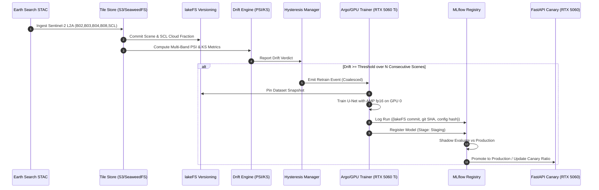

# Orbital-Drift: Development & Operational Reference Guide

**Project**: Orbital-Drift — Autonomous Sentinel-2 Continuous Training Pipeline on Dual GPUs  
**Compliance**: 2026 Standards, Constitution v1.1.0, Zero Hardcoded Values, 7-Tier $\ge 80\%$ Test Coverage  

---

## 1. Quick Start Commands

### Environment Diagnostics & Setup

```bash
# Run automated GPU & dependency diagnostic
python scripts/setup_gpu_env.py

# Inspect physical GPUs and VRAM allocations
nvidia-smi
```

### Running Test Suites

#### Tier A: Mock-First Test Suite (Fast CI / Hermetic)

```bash
# 1. Governance and security policy guards
pytest tests/governance -v

# 2. Pipeline boundary contract tests
pytest tests/contract -v

# 3. Fast unit tests
pytest tests/unit -v
```

#### Tier B: Live GPU Test Suite (Hardware Acceleration — No Mocks)

```bash
# 1. Hardware Sanity Check (RTX 5060 Ti 16GB + RTX 5060 8GB)
pytest tests/sanity/test_gpu_sanity.py -v -s

# 2. Live GPU Tensor Training (AMP fp16, grad accum, CUDA stream isolation)
pytest tests/integration/test_gpu_pipeline_live.py -v -s

# 3. Full End-to-End Continuous Training Loop (Ingest -> Drift -> Retrain -> Promote -> Rollback)
pytest tests/e2e/test_user_journey_ct_loop.py -v -s
```

#### Tier C: Full Coverage & Static Analysis Gate

```bash
# Measure statement coverage across src/orbital_drift (>= 85% floor)
pytest --cov=src/orbital_drift --cov-report=term-missing --cov-fail-under=85

# Lint and type check
ruff check src tests
mypy src tests
```

---

## 2. Hardware Topology & Allocation Matrix

| Node | Physical GPU | VRAM | CUDA Role | Batch & Optimization |
| :--- | :--- | :--- | :--- | :--- |
| **Node A** | **NVIDIA GeForce RTX 5060 Ti** | 16GB (Blackwell) | Primary Trainer (`cuda:0`) | Batch: 16–32, AMP fp16 (`GradScaler`), Grad Accum: 2 steps |
| **Node A** | **NVIDIA GeForce RTX 5060** | 8GB | Serving / Canary (`cuda:1`) | FastAPI inference, batch size 1–8, memory cap: 4GB |
| **Node B** | **NVIDIA Tesla P40 (Phase 5)** | 24GB (Pascal) | Heterogeneous Worker | Large-batch validation & historical backfill |

---

## 3. Architecture & Data Flow



---

## 4. Constitution Principles Cheat Sheet

1. **Principle I — Operator-Learning Primacy**: All live cluster mutations are operator-managed (`[HUMAN]`).
2. **Principle II — Boring Standard Stack**: PyTorch, TorchGeo, Airflow, Argo, MLflow, lakeFS, Evidently, Prometheus, FastAPI. No bespoke metric mathematics.
3. **Principle III — No Hardcoded Values**: All configuration must come from `OrbitalDriftConfig` via `pydantic-settings` or `.env`.
4. **Principle IV — Reproducibility**: Model runs record the immutable triple `{lakeFS commit, git SHA, config hash}`.
5. **Principle V — Test-First Contracts**: Every boundary is validated by contract tests in `tests/contract/`.
6. **Principle VI — The Soak is the Deliverable**: 6 continuous weeks of operation, $\ge 1$ organic retrain, and 1 executed rollback drill.
7. **Principle VII — Secrets Hygiene**: Zero credentials in git; enforced via gitleaks pre-commit hooks and CI gates.

---

## 5. Troubleshooting & Incident Protocol

- **WSL Path Mangling on Windows**: Always ensure `C:/Program Files/Git/bin/bash.exe` or `sh.exe` is resolved and POSIX paths (`.as_posix()`) are handed to shell subprocesses.
- **CUDA OOM Recovery**: If training fine-tune models exceeds VRAM budget, reduce `batch_size` in `OrbitalDriftConfig` and increase `gradient_accumulation_steps` to maintain effective batch size.
- **Canary Reversion / Rollback**: Call `ModelRegistryOps.rollback_production()` to immediately archive the regression and reinstate the prior Production model stage.
